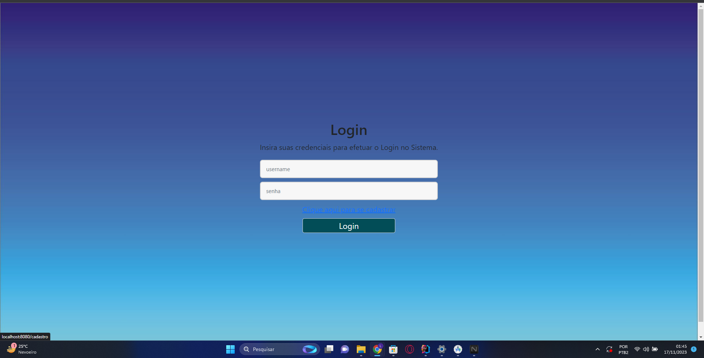
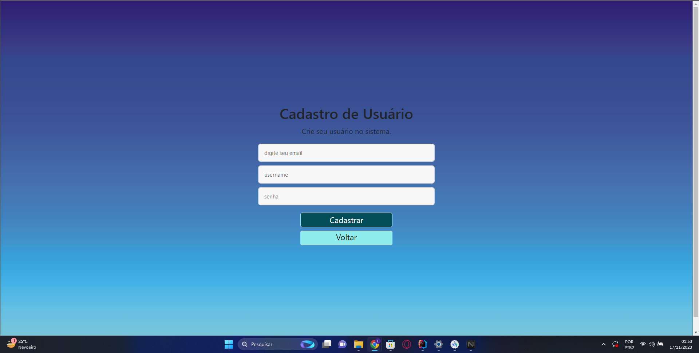
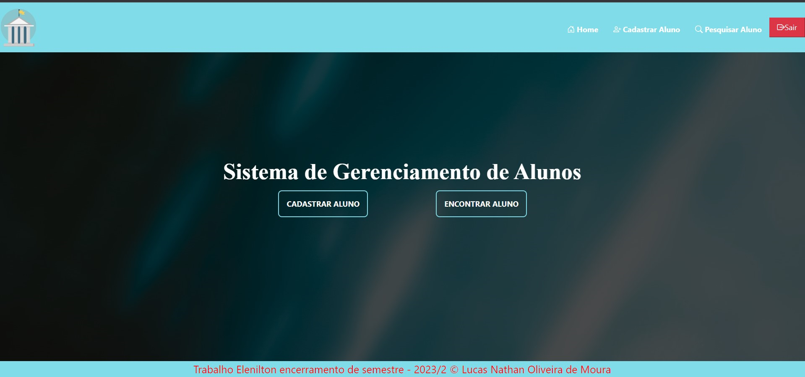
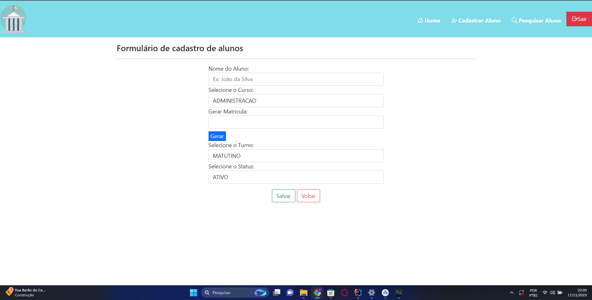
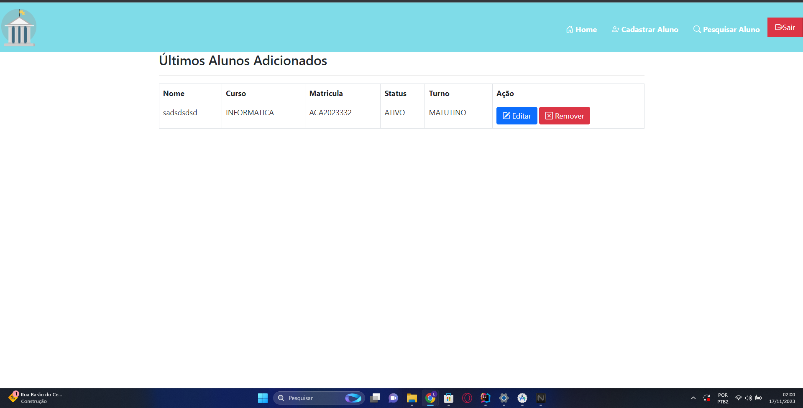
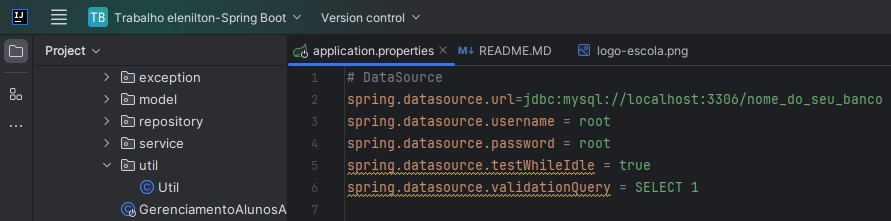
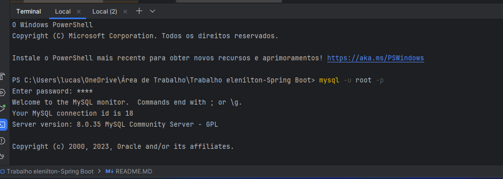

# Projeto Encerramento de semestre - 2023/2. Elenilton.

## Sistema de Gerenciamento de Alunos.

- Projeto em Java e construído com o Spring Boot. 
- O projeto conta com uma estrutura de CRUD, no qual os dados estão sendo persistidos em um banco de dados (MySQL).
- No Front-End foi utilizado HTML, CSS, o framework Bootstrap e o template Thymeleaf. Também foi utilizado e o JavaScript para validação de uma regra de negócio.

### Tecnologias Utilizadas.

- Java
- Spring Boot
- JPA / Hibernate
- Maven
- HTML/CSS/JS
- Bootstrap
- MySQL.

### Sistema.

Aparecera a tela de Login e Senha. 
Como voce ainda nao tem cadastro tera que se cadastrar.
Clique no botão de se cadastrar acima do botão de login.

## Tela de Cadastro

coloque seu Login.
Escolha uma Senha. 
E faça o cadastro.
Volte para tela de Login. Coloque seu Usuário e senha.

### Tela Principal

Voce tera a opção de cadastrar Aluno e Buscar Aluno. Cadastrando o Aluno Apareça no Banco de Dados. 

Após cadastrar o Aluno.

#### O projeto é gerenciado pelo Maven, então para usa-lo basta importa-lo para uma IDE.

## Voce tera que Configurar o banco de dados.
Você pode criar um banco de dados MySQL com o nome o nome de sua preferência, porém é necessário adequar o projeto de acordo com as suas configurações. Para isso abra o arquivo application.properties, localizado em src/main/resources/application.properties e altere os seguintes comandos ao arquivo:

Após concluído.

### Execução
Execute o projeto através do IDE, abra um navegador de sua preferência e digite: http://localhost:8080.

Espero que tenha compreendido.

